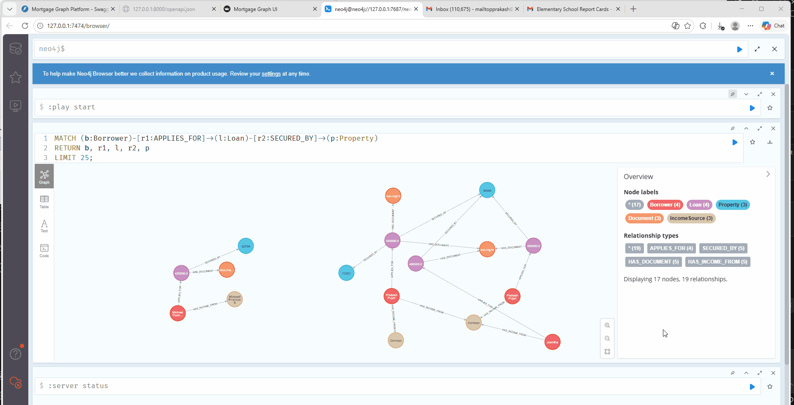

# Mortgage Graph Platform

Production-grade Neo4j mortgage knowledge graph implementation with ontology translation, ETL, GDS analytics, and FastAPI risk/compliance endpoints.

## Architecture

- `app/config`: env-driven settings and logging
- `app/db`: resilient Neo4j client
- `app/domain`: Pydantic schemas + scoring logic
- `app/etl`: batch ingestion and schema setup
- `app/ontology`: OWL/RDF to LPG mapping translator
- `app/gds`: graph projections and algorithm orchestration
- `app/services`: ingestion, rule evaluation, risk explanation
- `app/api`: REST endpoints
- `cypher`: reusable Cypher scripts
- `scripts`: export jobs
- `tests`: unit and API tests

## Data Model

Graph entities:
- Borrower, Loan, Property, IncomeSource, Document, UnderwritingRule, Regulation

Core workflow:
1. ETL loads entities and relationships idempotently.
2. GDS computes fraud/risk graph features.
3. API serves ingest/risk/explain flows.
4. Export writes aggregate metrics to CSV/Parquet.

## Quick Start (Docker)

1. Create env file:
```bash
cp .env.example .env
```

2. Start stack:
```bash
docker compose up -d --build
```

3. Apply schema migrations:
```bash
docker compose exec api python -m app.etl.migrate_schema
```

4. Run ETL load:
```bash
docker compose exec api python -m app.etl.run_full_load
```

5. Run GDS jobs:
```bash
docker compose exec api python -m app.gds.run_gds_jobs
```

6. Start/verify API:
- Health: `GET http://localhost:8000/health`
- Swagger: `http://localhost:8000/docs`

7. Run Streamlit UI (optional):
```bash
streamlit run app/ui/streamlit_app.py
```

The UI lets you:
- Check API health
- Ingest a loan payload
- Query risk and explain endpoints
- Explore graph data from Neo4j in the Graph Explorer tab

## Local Development Without Docker (Windows)

Use this path when Docker Desktop is unavailable.

### 1. Prerequisites

- Python virtual environment at `.venv`
- Java 17 installed
- Neo4j Community 5.x downloaded locally

Verify Java:

```powershell
java -version
```

### 2. Configure environment file

Create `.env` (or update existing values):

```env
PROJECT_NAME=Mortgage Graph Platform
ENV=dev
LOG_LEVEL=INFO
TIMEZONE=UTC
NEO4J_URI=bolt://localhost:7687
NEO4J_USER=neo4j
NEO4J_PASSWORD=changeme123
NEO4J_DATABASE=neo4j
DATA_PATH=./data/sample
EXPORT_PATH=./exports
```

### 3. Start Neo4j locally

If needed, download and extract Neo4j Community zip to a local tools folder.

Set Java 17 for the current terminal and initialize password before first start:

```powershell
$env:JAVA_HOME='C:\Program Files\Eclipse Adoptium\jdk-17.0.17.10-hotspot'
$env:Path="$env:JAVA_HOME\bin;$env:Path"
.\.local-tools\neo4j-community-5.26.0\bin\neo4j-admin.bat dbms set-initial-password "changeme123"
```

Run Neo4j:

```powershell
$env:JAVA_HOME='C:\Program Files\Eclipse Adoptium\jdk-17.0.17.10-hotspot'
$env:Path="$env:JAVA_HOME\bin;$env:Path"
.\.local-tools\neo4j-community-5.26.0\bin\neo4j.bat console
```

Verify Bolt connectivity:

```powershell
Test-NetConnection -ComputerName 127.0.0.1 -Port 7687
```

### 4. Start FastAPI locally

Install dependencies (minimum needed runtime packages shown):

```powershell
.\.venv\Scripts\python.exe -m pip install fastapi uvicorn neo4j psycopg pydantic-settings
```

Start API:

```powershell
.\.venv\Scripts\python.exe -m uvicorn app.main:app --host 127.0.0.1 --port 8000
```

Health check:

```powershell
Invoke-RestMethod -Method Get -Uri http://127.0.0.1:8000/health
```

### 5. Start Streamlit UI locally

```powershell
.\.venv\Scripts\python.exe -m pip install streamlit
.\.venv\Scripts\python.exe -m streamlit run app/ui/streamlit_app.py --server.address 127.0.0.1 --server.port 8501
```

Endpoints:

- API: `http://127.0.0.1:8000`
- API Docs: `http://127.0.0.1:8000/docs`
- Streamlit: `http://127.0.0.1:8501`
- Neo4j Browser: `http://127.0.0.1:7474/browser/`

## Graph Visualization in UI

The Streamlit app includes a Graph Explorer tab.

1. Open Streamlit at `http://127.0.0.1:8501`
2. Go to Graph Explorer
3. Enter Neo4j connection values:
  - URI: `bolt://localhost:7687`
  - User: `neo4j`
  - Password: your Neo4j password
  - Database: `neo4j`
4. Pick a preset query or use custom Cypher
5. Click Run Graph Query

Tip: return path or node/relationship objects (for example `RETURN p`) to render a graph.

## Neo4j Browser Graph View

Open Neo4j Browser and run:

```cypher
MATCH p=()-[r]->()
RETURN p
LIMIT 50;
```

Or focus on a specific loan:

```cypher
MATCH p=(l:Loan {loanId: 'L101'})-[*1..2]-(n)
RETURN p
LIMIT 50;
```

## Troubleshooting

### Database unavailable on localhost:7687

Cause: Neo4j is not running or wrong port.

Check:

```powershell
Test-NetConnection -ComputerName localhost -Port 7687
```

### Unauthorized Neo4j authentication

Cause: machine-level environment variables override `.env` values.

Example conflict:

- `NEO4J_PASSWORD` set globally to a different value.

Check active variables:

```powershell
Get-ChildItem Env:NEO4J*
```

Fix options:

- Clear conflicting global env vars in your shell/session.
- Or launch API with explicit env values in the same terminal session.

### Neo4j class version / Java mismatch

Cause: Neo4j started with Java 11 while Neo4j 5.x needs Java 17.

Fix: set `JAVA_HOME` to Java 17 before running Neo4j commands.

### Docker daemon not available

If `docker compose up` fails with Docker engine pipe errors, start Docker Desktop or use the local native Neo4j path documented above.

## Demo Media Placeholder

Use this section for visual walkthrough assets.

### Neo4j Browser Screenshot

Place the screenshot file at `docs/assets/neo4j-browser-graph.png`, then this image will render in README:

```md

```

### Animated GIF

Place the GIF file at `docs/assets/MortgageGRAPH-Neo4j.gif`, then this image will render in README:

```md

```

Suggested GIF content:

1. Start API health check
2. Ingest a sample loan
3. Open Graph Explorer tab in Streamlit
4. Run a graph query and show rendered relationships
5. Open Neo4j Browser and run `RETURN p` query

### Optional: Local Postgres Ingest Mode

If Neo4j is unavailable and you only need `/loans/ingest`, you can use Postgres:

```bash
STORAGE_BACKEND=postgres
POSTGRES_DSN=jdbc:postgresql://localhost:5432/postgres
```

Notes:
- `jdbc:postgresql://...` and `postgresql://...` are both accepted.
- In Postgres mode, `/loans/{loanId}/risk` and `/loans/{loanId}/explain` return `501` (Neo4j-only features).

## API Examples

### POST /loans/ingest
```json
{
  "borrower": {"borrowerId": "B100", "name": "Alex Chen", "ssnHash": "hash-100", "dob": "1987-03-10"},
  "loan": {"loanId": "L100", "amount": 450000, "status": "submitted", "purpose": "purchase", "originationDate": "2026-02-01", "ltv": 78.0, "dti": 39.0},
  "property": {"propertyId": "P100", "address": "1 Main St", "city": "Austin", "state": "TX", "zip": "73301", "type": "single_family"},
  "income": {"incomeId": "I100", "type": "w2", "employerName": "Contoso", "annualIncome": 175000, "startDate": "2020-01-01"},
  "documents": [{"documentId": "D100", "type": "paystub", "sourceSystem": "doc-mgmt", "uploadedAt": "2026-02-02T13:00:00"}]
}
```

### GET /loans/{loanId}/risk
Returns traditional metrics, graph metrics, and composite scores.

### GET /loans/{loanId}/explain
Returns rules, linked regulations, and graph signal contributions.

## Ontology Translation

Translate OWL/RDF files to LPG mapping:
```bash
python -m app.ontology.run_translate --input ./ontology --output ./exports/mapping.yaml --overrides ./ontology/overrides.yaml
```

## Exports

Run metrics export:
```bash
python scripts/export_metrics.py
```

Output files:
- `exports/loan_metrics.csv`
- `exports/loan_metrics.parquet`

## Testing

```bash
pytest -q
```

## CI

- GitHub Actions workflow: `.github/workflows/ci.yml`
- Triggers on push and pull request
- Runs Python 3.11 test job with `pytest -q`
# graphdb
