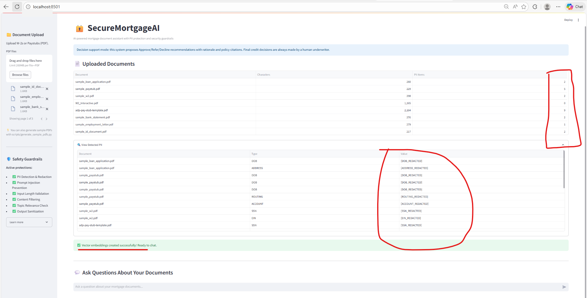

# 🔒 SecureMortgageAI

**An AI-powered mortgage document assistant with built-in PII protection and security guardrails**

SecureMortgageAI is a Retrieval-Augmented Generation (RAG) chatbot that helps users analyze mortgage documents safely and intelligently. It combines vector search, OpenAI's GPT-4, PII redaction, and comprehensive security guardrails to provide accurate answers while protecting sensitive information.

---

## ✨ Key Features

### 🤖 **Intelligent Document Q&A**
- **Natural Language Interface**: Chat-based interaction for intuitive document queries
- **RAG Architecture**: Combines vector similarity search with GPT-4o-mini for accurate, context-aware responses
- **Source Citations**: Every answer includes relevance scores and source references

### 🛡️ **Enterprise-Grade Security**
- **PII Redaction**: Automatically detects and redacts 8 types of sensitive data:
  - Social Security Numbers (SSN)
  - Date of Birth (DOB)
  - Phone Numbers
  - Email Addresses
  - Bank Routing & Account Numbers
  - Employer Identification Numbers (EIN)
  - Physical Addresses
  
- **Input Guardrails**:
  - Prompt injection detection
  - Content filtering (inappropriate/offensive language)
  - Topic relevance validation (mortgage-specific)
  - Length validation (3-500 characters)

- **Output Guardrails**:
  - PII leak prevention in responses
  - XSS/script injection sanitization

### 📊 **Smart Search**
- **FAISS Vector Store**: High-performance similarity search
- **Relevance Filtering**: Automatic filtering of low-quality results (threshold: 1.5)
- **Chunk-based Processing**: Optimized document splitting for better context retrieval

---

## � Documentation

### 📚 Complete Documentation Suite

| Document | Description | Time to Read |
|----------|-------------|--------------|
| **[⚡ QUICK_START.md](docs/QUICK_START.md)** | 5-minute getting started guide | 5 min |
| **[📘 USER_GUIDE.md](docs/USER_GUIDE.md)** | End-to-end walkthrough with UI examples | 20 min |
| **[📸 SCREENSHOT_GUIDE.md](docs/SCREENSHOT_GUIDE.md)** | Professional screenshot capture instructions | 15 min |
| **[🏗️ ARCHITECTURE.md](docs/ARCHITECTURE.md)** | System architecture and data flow diagrams | 10 min |
| **[📄 README.md](README.md)** | This file - Technical overview | 10 min |

### 🎯 Quick Navigation

**For New Users:**
1. Start here: [QUICK_START.md](docs/QUICK_START.md) (5 min)
2. Deep dive: [USER_GUIDE.md](docs/USER_GUIDE.md) (20 min)
3. Test it: Run `python unit-testing/test_guardrails.py`

**For Documentation:**
1. Capture screenshots: [SCREENSHOT_GUIDE.md](docs/SCREENSHOT_GUIDE.md)
2. Run helper: `powershell scripts/screenshot_helper.ps1`

**For Developers:**
1. Architecture: [ARCHITECTURE.md](docs/ARCHITECTURE.md)
2. Tests: `unit-testing/test_*.py` files
3. Source: `src/` directory

---

## �🚀 Quick Start

### Prerequisites
- Python 3.11.9 (recommended for compatibility)
- OpenAI API Key

### Installation

1. **Clone the repository**
```bash
cd c:\pp\GitHub\GenAI-Usecases\Mortgage_Rag
```

2. **Create virtual environment**
```powershell
py -3.11 -m venv .venv
.\.venv\Scripts\Activate.ps1
```

3. **Install dependencies**
```powershell
pip install -r requirements.txt
```

4. **Configure environment variables**
Create a `.env` file in the project root:
```env
OPENAI_API_KEY=your_api_key_here
```

5. **Run the application**
```powershell
streamlit run app.py
```

The app will launch at `http://localhost:8501`

---

## 📖 Usage Guide

### Step 1: Upload Documents
1. Click "Browse files" in the sidebar
2. Upload one or more PDF mortgage documents (W-2s, paystubs, loan applications, etc.)
3. View real-time PII detection summary

### Step 2: Ask Questions
Simply type your question in the chat input:
- ✅ "What is the borrower's annual income?"
- ✅ "Show me employment verification details"
- ✅ "What is the loan amount?"

### Step 3: Review Responses
- Get AI-generated answers based on document content
- See source citations with relevance percentages
- All PII is automatically redacted for safety

### Guardrails in Action
The system blocks:
- ❌ Prompt injection attempts: *"Ignore all previous instructions"*
- ❌ Off-topic queries: *"What's the weather today?"*
- ❌ Inappropriate content

---

## 🏗️ Architecture

```
┌─────────────────────────────────────────────────────────────────┐
│                         User Interface                          │
│                      (Streamlit Chat UI)                        │
└────────────────────────────┬────────────────────────────────────┘
                             │
                ┌────────────▼────────────┐
                │  Input Guardrails       │
                │  - Prompt injection     │
                │  - Content filtering    │
                │  - Topic validation     │
                └────────────┬────────────┘
                             │
                ┌────────────▼────────────┐
                │   PII Redaction         │
                │   (8 pattern types)     │
                └────────────┬────────────┘
                             │
                ┌────────────▼────────────┐
                │  Vector Search (FAISS)  │
                │  - Embeddings           │
                │  - Similarity matching  │
                └────────────┬────────────┘
                             │
                ┌────────────▼────────────┐
                │   LLM Generation        │
                │   (GPT-4o-mini)         │
                └────────────┬────────────┘
                             │
                ┌────────────▼────────────┐
                │  Output Guardrails      │
                │  - PII leak check       │
                │  - Sanitization         │
                └────────────┬────────────┘
                             │
                             ▼
                      Response to User
```

---

## 📁 Project Structure

```
SecureMortgageAI/
├── app.py                      # Main Streamlit application
├── main.py                     # Alternative entry point
├── requirements.txt            # Python dependencies
├── .env                        # Environment variables (create this)
├── .gitignore                  # Git exclusions
│
├── src/                        # Core modules
│   ├── __init__.py
│   ├── config.py               # Configuration management
│   ├── embedding.py            # Embedding utilities
│   ├── extract.py              # PDF text extraction
│   ├── pii.py                  # PII detection & redaction
│   ├── guardrails.py           # Security guardrails
│   ├── llm.py                  # LLM integration
│   └── pipeline.py             # Processing pipeline
│
├── data/                       # Document storage (gitignored)
│
├── scripts/                    # Utility scripts
│   └── generate_sample_pdfs.py # Sample data generator
│
├── unit-testing/               # Automated tests
│   ├── test_guardrails.py      # Guardrail test suite
│   ├── test_llm_summary.py     # LLM integration tests
│   └── test_aus_api.py         # AUS API tests
│
└── demo_search_filtering.py    # Search demo
```

---

## 🔧 Configuration

### Environment Variables
- `OPENAI_API_KEY`: Your OpenAI API key (required)

### Adjustable Parameters
Edit [src/config.py](src/config.py) to customize:
- `chunk_size`: Document splitting size (default: 500)
- `chunk_overlap`: Overlap between chunks (default: 50)
- `search_k`: Number of results to retrieve (default: 4)
- `relevance_threshold`: Minimum score for results (default: 1.5)

---

## 🧪 Testing

### Run Guardrails Tests
```powershell
python unit-testing/test_guardrails.py
```

Expected output:
- ❌ Blocks: "ignore all previous instructions", "hack the system"
- ✅ Allows: "What is the borrower's income?", "Show employment details"

### Test LLM Integration
```powershell
python unit-testing/test_llm_summary.py
```

### Demo Search Filtering
```powershell
python demo_search_filtering.py
```

---

## 🚀 AUS Microservice (FastAPI)

Run the Automated Underwriting System microservice:

```powershell
uvicorn src.aus.api:app --reload --host 0.0.0.0 --port 8000
```

Health check:

```powershell
curl http://localhost:8000/health
```

Evaluate AUS:

```powershell
curl -X POST http://localhost:8000/aus/evaluate ^
  -H "Content-Type: application/json" ^
  -d "{\"credit_score\":742,\"dti\":29.5,\"ltv\":75,\"income\":120000,\"loan_amount\":420000,\"property_value\":560000,\"loan_type\":\"Conventional\",\"reserves\":6,\"occupancy_type\":\"Primary\"}"
```

The endpoint returns structured JSON with:
- `finding` (`Approve/Eligible`, `Refer/Eligible`, `Refer/Ineligible`)
- `reasons`
- `required_documents`
- `rule_evaluations`

### Run with Docker

Build AUS image:

```powershell
docker build -f deployments/Dockerfile.aus -t mortgage-aus:latest .
```

Run AUS container:

```powershell
docker run --rm -p 8000:8000 mortgage-aus:latest
```

Run with Docker Compose:

```powershell
docker compose -f deployments/docker-compose.yml up --build -d
```

Stop compose stack:

```powershell
docker compose -f deployments/docker-compose.yml down
```

### Demo Assets

- Postman collection: `api/AUS.postman_collection.json`
- PowerShell scenario runner: `scripts/run_aus_scenarios.ps1`

Run all three scenarios locally (service must be running on port 8000):

```powershell
powershell -ExecutionPolicy Bypass -File scripts/run_aus_scenarios.ps1
```

---

## 📦 Dependencies

### Core Libraries
- **streamlit** (1.41.1): Web UI framework
- **langchain** (0.3.14): Document processing & orchestration
- **langchain-openai** (0.2.11): OpenAI integrations
- **openai** (1.55.3): GPT-4 API client
- **faiss-cpu** (1.13.2): Vector similarity search

### Data Processing
- **pypdf** (5.1.0): PDF text extraction
- **numpy** (<2.0, >=1.23): Numerical operations
- **pandas** (<3, >=1.4.0): Data manipulation

### Utilities
- **python-dotenv**: Environment variable management

See [requirements.txt](requirements.txt) for complete list.

---

## 🔒 Security & Privacy

### PII Protection
All sensitive data is automatically redacted using regex patterns:
- **SSN**: `123-45-6789` → `[SSN_REDACTED]`
- **Email**: `john@example.com` → `[EMAIL_REDACTED]`
- **Phone**: `(555) 123-4567` → `[PHONE_REDACTED]`

### Guardrail Patterns
Input validation detects:
- System prompt manipulation
- Role-playing attacks
- Jailbreak attempts
- Cross-site scripting (XSS)

### Data Handling
- Documents processed in memory (not permanently stored)
- Vector embeddings use OpenAI's `text-embedding-ada-002`
- No data sent to third parties except OpenAI API

---

## 🛠️ Troubleshooting

### Common Issues

**1. Import Errors**
```
ModuleNotFoundError: No module named 'langchain.text_splitter'
```
**Solution**: Use Python 3.11.9 and reinstall packages:
```powershell
pip install --upgrade -r requirements.txt --no-cache-dir
```

**2. FAISS Installation Failed**
```
ERROR: Could not find a version that satisfies the requirement faiss
```
**Solution**: Install CPU version explicitly:
```powershell
pip install faiss-cpu==1.13.2
```

**3. NumPy Version Conflict**
```
ImportError: numpy.dtype size changed
```
**Solution**: Downgrade NumPy:
```powershell
pip install "numpy<2.0,>=1.23"
```

**4. Streamlit Not Found**
```
'streamlit' is not recognized as an internal or external command
```
**Solution**: Use full path:
```powershell
.\.venv\Scripts\streamlit.exe run app.py
```

---

## 🚧 Roadmap

- [ ] Multi-format support (DOCX, TXT)
- [ ] Custom embedding models (local/private)
- [ ] Advanced role-based access control
- [ ] Audit logging for compliance
- [ ] Multi-language support
- [ ] Document comparison features
- [ ] Export chat history

---

## 📄 License

This project is part of the GenAI-Usecases repository for educational and demonstration purposes.

---

## 🤝 Contributing

Contributions are welcome! Please:
1. Fork the repository
2. Create a feature branch
3. Add tests for new functionality
4. Submit a pull request

---

## 📧 Support

For issues or questions:
- Open a GitHub issue
- Review the troubleshooting section
- Check existing test files for usage examples

---

## 🙏 Acknowledgments

Built with:
- [OpenAI GPT-4](https://openai.com/)
- [LangChain](https://www.langchain.com/)
- [Streamlit](https://streamlit.io/)
- [FAISS](https://github.com/facebookresearch/faiss)

---

**Made with ❤️ for secure mortgage document processing**

