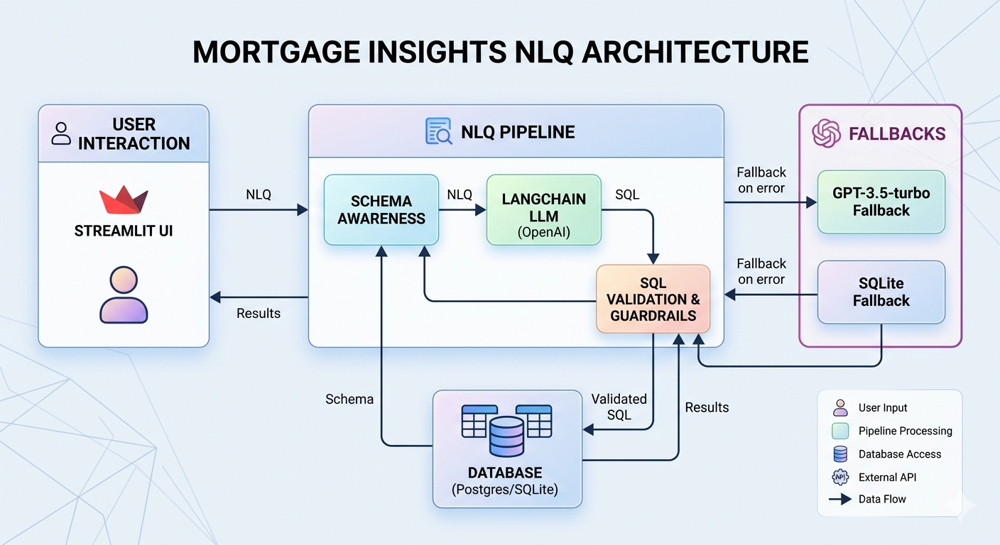

# Mortgage Insights NLQ Architecture



```mermaid
flowchart TD
    A[User (Streamlit UI)] -->|NLQ| B[NLQ Pipeline]
    B --> C[LangChain LLM (OpenAI)]
    B --> D[Schema Awareness]
    D --> E[Database (Postgres/SQLite)]
    B --> F[SQL Validation & Guardrails]
    F --> E
    C -->|SQL| F
    F -->|Results| A
    E -->|Schema| D
    subgraph Fallbacks
      E2[SQLite Fallback]
      C2[GPT-3.5-turbo Fallback]
    end
    B -- Fallback on error --> E2
    B -- Fallback on error --> C2
    E2 --> D
    C2 --> F
```

- Users interact with the Streamlit UI and enter NLQ (natural language queries).
- The NLQ pipeline handles schema awareness, LLM (OpenAI) calls, SQL validation, and database execution.
- If the main database or LLM fails, the system falls back to SQLite or GPT-3.5-turbo.
- Results are validated and returned to the user.
